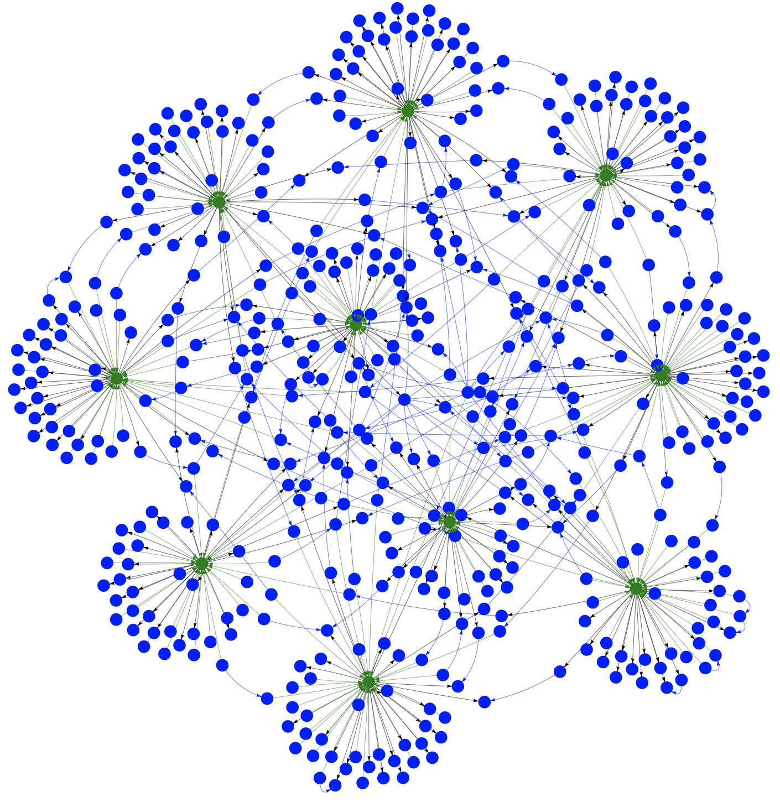

# Simple graph data in PostgreSQL
This repository demonstrates how to build and use a simple graph data structure in *PostgreSQL*.  
The goal is to show how you can utilize PostgreSQL for graph-like data with a simple example.

### Setup Instructions

1. Python 3.6+  
2. Docker Compose

#### Set up a Python Virtual Environment and install dependencies

First, create and activate a Python virtual environment.  
You can name it `graphenv` (or any other name you prefer).

```bash
python -m venv graphenv
source graphenv/bin/activate  # On Windows, use 'graphenv\Scripts\activate'
```

Install the required Python dependencies.

```bash
pip install -r requirements.txt
```

#### Generate SQL for Data

Before starting the database, you'll need to create the necessary SQL to populate it with data.  
The script fetches random user data from `https://randomuser.me` to populate the database.

```bash
python generate_sql.py      # creates 500 nodes as default
python generate_sql.py 2000 # creates 2000 nodes
...
```

This will generate the SQL script and save it to `./initdb/init.sql`, which will be used to initialize the database.

#### Start the PostgreSQL Database with Docker Compose

You can use Docker Compose to set up and start the PostgreSQL database.

```bash
docker compose up
```

This will start the PostgreSQL container and set up the database with executing the `./initdb/init.sql` script.

#### View the Graph

Once the database is running and populated with data, you can visualize the graph using *pyvis*.  
The script will generate a `show.html` file that you can open in your browser to view the graph.

Run the following command:

```bash
python display.py
```

This will create a visualization of the graph, showing users and their `LIKES` relationships.



### Database Structure

- **Nodes**: Represented by the `USER` label. Each node contains a `label` (string) and `props` (JSON) to store relevant information.
- **Edges**: Represented by the `LIKES` label, indicating the relationship between users. Each edge has a `previous` and `next` field containing the ID of the respective nodes to show the direction of the relationship.

### Example Use Case

In this example, all users (nodes) have the `USER` label, and edges (connections between users) have the `LIKES` label, forming a graph where `USER`, `LIKES` each other.

It's simple to add other labels to have different nodes with different edges.  
To extend to a `USER` `LIKES` `PRODUCT` or `USER`, `WORKS`, `COMPANY` graph structure.

This is just a basic example of using PostgreSQL for graph-like data storage. You can modify the SQL schema and queries in the `generate_sql.py` script to suit your specific use case and graph structure.

### Query examples

Query the graph for getting all nodes, all labels of the nodes or all nodes with a specific label.

    SELECT * FROM nodes;
    SELECT DISTINCT label FROM nodes;
    SELECT * FROM nodes WHERE label='User';

Get all outgoing or incoming nodes for a specific node with id equals one.

    SELECT *
      FROM nodes
    JOIN edges ON nodes.id = edges.next_node
      WHERE edges.previous_node = 1;

    SELECT *
      FROM nodes
    JOIN edges ON nodes.id = edges.previous_node
      WHERE edges.next_node = 1;

Get the ids of the nodes connected to nodes where node with id equals one is connected to.

    SELECT DISTINCT e2.next_node
      FROM edges AS e1 
    JOIN edges AS e2 ON e1.next_node = e2.previous_node 
      WHERE 
        e1.label = 'LIKES' AND 
        e2.label = 'LIKES' AND 
        e1.previous_node = 1 AND 
        e1.next_node <> 1 AND 
        e2.next_node <> 1;

Use `UNION` to get a depth of the relationshsip.

    SELECT DISTINCT nodes.id, 1 AS depth
      FROM nodes 
    JOIN edges ON nodes.id = edges.next_node AND edges.previous_node = 1 
      WHERE edges.label = 'LIKES'    
    UNION
    SELECT DISTINCT e2.next_node, 2 AS depth
      FROM edges AS e1 
    JOIN edges AS e2 ON e1.next_node = e2.previous_node 
      WHERE 
        e1.label = 'LIKES' AND         
        e2.label = 'LIKES' AND 
        e1.previous_node = 1 AND 
        e1.next_node <> 1 AND 
        e2.next_node <> 1;

Use `RECURSIVE` to get the depth and path from one node to another.

    WITH RECURSIVE likes AS (
        SELECT
          next_node AS id,
          1 AS depth,
          ARRAY[previous_node] AS path
        FROM edges
          WHERE previous_node = 1
        UNION ALL
        SELECT
          edges.next_node,
          likes.depth + 1,
          likes.path || edges.previous_node
        FROM likes
          JOIN edges ON edges.previous_node = likes.id
          WHERE NOT edges.next_node = ANY(likes.path)
    )
    SELECT id, depth, path || id AS path
    FROM likes
    WHERE depth <= 2;

The script executes some of the SQL statements and print it as table to the console.

    python sql_queries.py     # uses node id 1 as default
    python sql_queries.py 100 # uses node id 100

How to define the SQL queries and the structure of the graph is depending on the use case.  
This was an example for the posibility to use PostgreSQL as graph database.

## Feedback
Star this repo if you found it useful. Use the github issue tracker to give feedback on this repo.